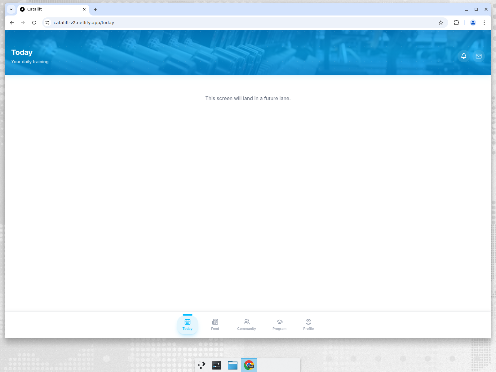
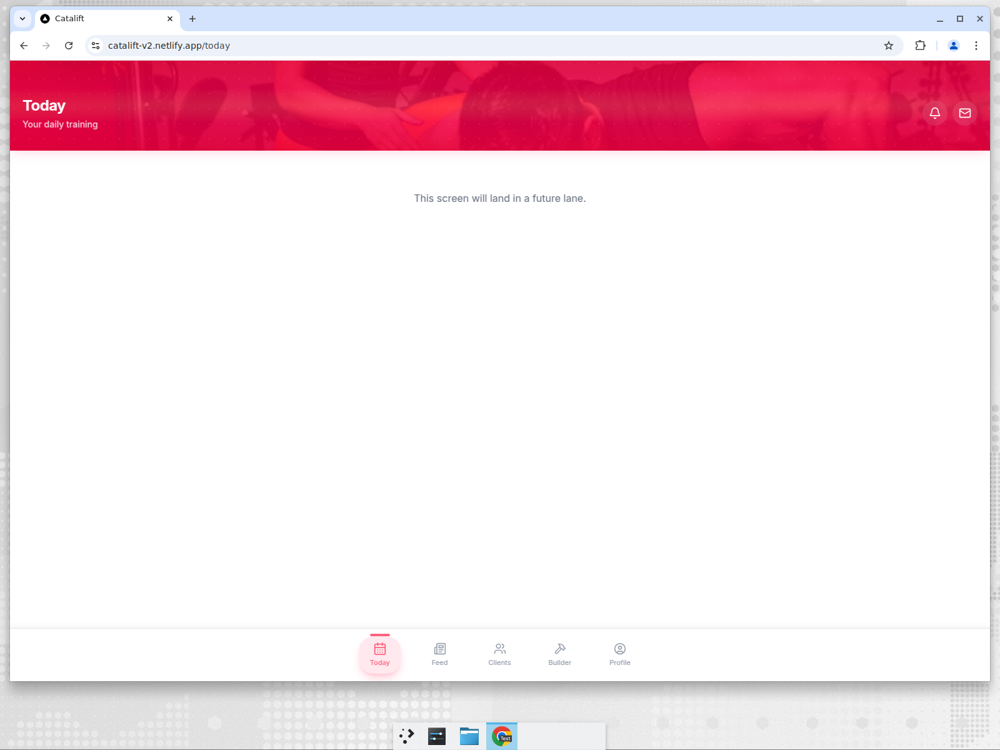
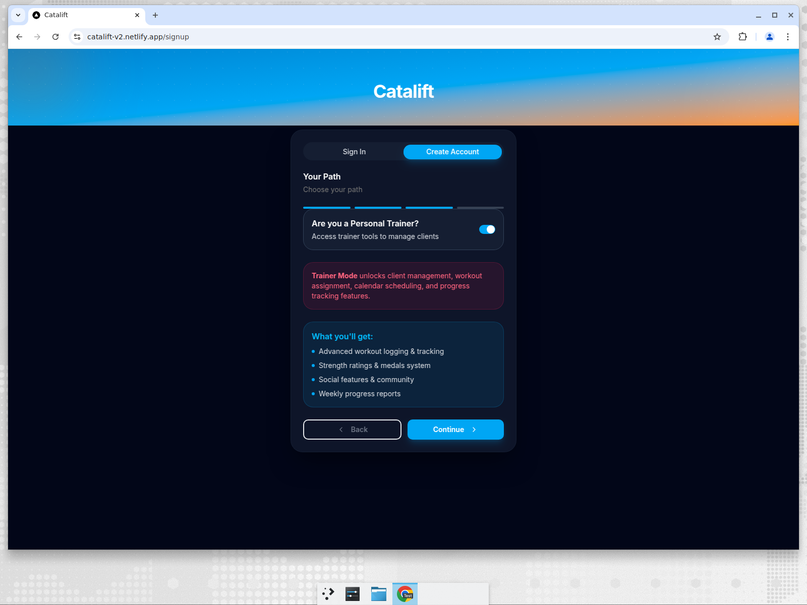
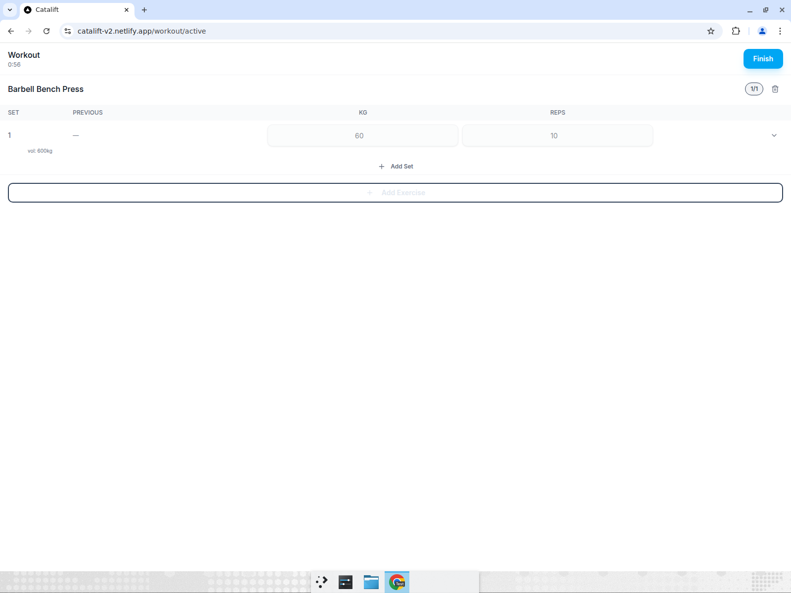

# QA Report — CADENCE walkthrough + v1↔v2 parity

- **Target:** https://catalift-v2.netlify.app (staging)
- **Commit under test:** `d2e0fcc` (main) — w1 programs (#12) + w2a workout straight-set execution (#13) merged
- **Supabase project:** `igagmdkdzjkxrwnyvgqk`
- **Date:** 2026-06-26
- **Mode:** report-only. No app code, schema, prod, or v1 touched. Evidence is real (live network capture + screenshots), not asserted.

## Test accounts (self-created, v2 staging)

| Role | Email | User ID | Notes |
|---|---|---|---|
| Client | `qa+client1782497232@catalift.test` | `d1a1c6f1-5f2d-4330-8f5a-9d417721b672` | role toggle OFF |
| Trainer | `qa+trainer1782639@catalift.test` | `5c01bff8-e5f8-4c79-9513-cc9ed7988244` | role toggle ON |

> Cleanup note: both accounts are blocked from writing their profile rows by ISSUE-1 (below), so only `auth.users` rows exist. Flagging for Christo to purge from the Supabase dashboard since there is no self-serve account-deletion path on staging yet.

---

## ⭐ Re-verification (2026-06-26, later) — BUG-013 fix confirmed

After fix #16 (`9750549`, "re-grant EXECUTE on are_connected/is_conversation_member to authenticated") merged to `main`, I re-ran the authed data layer against live staging. **ISSUE-1 / BUG-013 (`42501 permission denied for function are_connected`) is FIXED on the live DB.**

New re-verify account: `qa+client1782685@catalift.test` · `600a4468-74b3-43d6-9ac5-0682205a3637` (client).

| Check | Before (BUG-013) | Now | Verdict |
|---|---|---|---|
| Signup `POST /auth/v1/signup` | 200 | `200` | ok |
| **users WRITE** `PATCH /rest/v1/users` (profile) | `403` 42501 | **`204`** | ✅ fixed |
| **users READ** `GET /rest/v1/users?select=role` (uses `are_connected` policy) | `403` 42501 | **`200 {"role":"client"}`** | ✅ fixed |
| Login `POST /auth/v1/token?grant_type=password` | n/a | `200` | ok |
| post-login users READ `GET …select=role` | `403` 42501 | **`200 {"role":"client"}`** | ✅ fixed |
| **workouts READ** `GET /rest/v1/workouts` (uses `are_connected` policy) | (blocked) | **`200 []`** | ✅ fixed |
| workouts WRITE `POST /rest/v1/workouts` | n/a | **`400 22P02 invalid input syntax for type uuid: "stub-user-id"`** | ⚠️ **BUG-014** (known, fix in flight) — NOT a 42501 |

```
# signup → users write+read now 2xx (was 403/42501)
PATCH /rest/v1/users?id=eq.600a4468-…  → 204
GET   /rest/v1/users?select=role&id=eq.600a4468-…  → 200 {"role":"client"}

# login → 2xx
POST  /auth/v1/token?grant_type=password  → 200
GET   /rest/v1/users?select=role&id=eq.600a4468-…  → 200 {"role":"client"}

# direct authenticated workouts read (are_connected SELECT policy) → 2xx
GET   /rest/v1/workouts?select=id,user_id,created_at&limit=5  → 200 []

# workout save still fails — but with 400 (BUG-014 stub-user-id), NOT 42501
POST  /rest/v1/workouts  → 400 {"code":"22P02","message":"invalid input syntax for type uuid: \"stub-user-id\""}
```




**Conclusion:** the authenticated `public.*` data layer is testable again. ISSUE-1 (BUG-013) resolved. Remaining known items unchanged and NOT re-filed: **ISSUE-2 / BUG-014** (`/workout/active` `stub-user-id` → workout save 400, fix in flight) and **ISSUE-4 / BUG-012** (`(app)` routes lack server-side auth gate). Everything below this section is the original (pre-fix) report, retained for history.

### Trainer role-routing re-check — ISSUE-3 also resolved

Fresh trainer signup with the role toggle **ON**: `qa+trainer1782687@catalift.test` · `234ba33e-4d6a-4c75-8b57-84ab1873d2e7`.

```
POST  /auth/v1/signup                              → 200
PATCH /rest/v1/users?id=eq.234ba33e-…  (role write) → 204
GET   /rest/v1/users?select=role&id=eq.234ba33e-…  → 200 {"role":"trainer"}
```

- **Role value:** `"trainer"` — persisted and read back correctly (was `403`/never-persisted before BUG-013 fix).
- **Landing route:** `/today`, rendered in the **trainer shell** — bottom nav is **Today · Feed · Clients · Builder · Profile** (vs the client shell's Today · Feed · Community · Program · Profile) and the theme is crimson (client is blue). So the role-aware shell **is built**; it was simply unreachable while BUG-013 blocked the role read.



ISSUE-3 (trainer landed in client shell) was a downstream symptom of BUG-013 and is now resolved. (`/clients` and `/builder` pages themselves are still "future lane" placeholders — feature work, not a regression.)

---

## TL;DR

Part A is **blocked at the data layer**. Signup (auth) works, but **every authenticated read/write to `public.*` returns `403 permission denied for function are_connected`** — a Class B schema bug introduced by migration `00005`. On top of that the workout screen writes a **hardcoded `stub-user-id`** instead of the real session user (Class A). Net result: roles don't persist, workouts don't save, and program-assignment / payment UIs aren't built yet. Part B parity (auth / workout-engine / data-sync) is otherwise **clean** — v2 correctly drops the known v1 footguns.

**2 blockers (1 Class B critical, 1 Class A high) + 5 lower issues. Do not auto-fix Class B — Christo sign-off required.**

---

# Part A — CADENCE critical-path smoke

| # | Step | Result | Evidence |
|---|---|---|---|
| 1a | Sign up **client**, lands in client shell | ⚠️ PASS-with-errors | lands in `/today` client shell, but profile writes 403 (ISSUE-1) |
| 1b | Sign up **trainer** (role toggle ON), lands in trainer shell | ❌ FAIL | toggle works in UI, but role never persists (403) → lands in **client** shell (ISSUE-1, ISSUE-3) |
| 2 | Trainer assigns a program to the client | ⛔ NOT TESTABLE | `/builder`, `/clients`, `/program` are placeholders ("This screen will land in a future lane") — ISSUE-6 |
| 3 | Client records a workout (sets/reps/weight); persists | ❌ FAIL | `/workout/active` logs sets in UI, but Finish → "Could not save workout" — `400` stub-user-id (ISSUE-2), compounded by ISSUE-1 |
| 4 | Trainer records a payment | ⛔ NOT TESTABLE | no payment UI exists (only a Stripe "connect" toggle in onboarding) — ISSUE-6 |
| 5 | Hard-refresh authed routes (G-18) | ✅ PASS (with caveat) | `/today` survives hard refresh, no `/login` bounce, no white screen. Caveat: `(app)` routes have no server-side auth gate (ISSUE-4) |
| 6 | Second-session cross-device (G-12) | ⛔ NOT TESTABLE | no user data can be written (all writes 403/400) → nothing to observe syncing |

## Evidence

### Step 1b — trainer signup: 200, then role write/read all 403

The 4-step signup wizard works end-to-end in the UI; the role toggle ("Are you a Personal Trainer?") flips and shows the Trainer-Mode note:



After "Create Account", the live network capture (fetch interceptor on the page) shows the Supabase calls:

```
POST /auth/v1/signup?redirect_to=…/callback           → 200  (JWT, sub=5c01bff8-…)
PATCH /rest/v1/users?id=eq.5c01bff8-…                  → 403  {"code":"42501","message":"permission denied for function are_connected"}
PATCH /rest/v1/users?id=eq.5c01bff8-…                  → 403  (retry 2)
PATCH /rest/v1/users?id=eq.5c01bff8-…                  → 403  (retry 3)
GET  /rest/v1/users?select=role&id=eq.5c01bff8-…       → 403  {"code":"42501","message":"permission denied for function are_connected"}
GET  /rest/v1/users?select=role&id=eq.5c01bff8-…       → 403  (retry)
GET  /rest/v1/users?select=role&id=eq.5c01bff8-…       → 403  (retry)
GET  /rest/v1/users?select=role&id=eq.5c01bff8-…       → 403  (retry)
```

The role is never persisted (PATCH 403) and never readable (GET 403), so the app can't know the user is a trainer → it lands in the **client** shell (bottom nav: Today / Feed / Community / Program / Profile):


> The triple-retry pattern is guardrail #3 working as designed (await + retry, max 3) — the failure is the underlying 403, not the write logic.

### Step 3 — workout save: 400 invalid uuid (`stub-user-id`)

Logged Barbell Bench Press 60 kg × 10 (vol 600 kg) and pressed Finish:



Live capture of the `workouts` insert:

```
POST /rest/v1/workouts → 400 {"code":"22P02","message":"invalid input syntax for type uuid: \"stub-user-id\""}
POST /rest/v1/workouts → 400 (retry 2)
POST /rest/v1/workouts → 400 (retry 3)
```

Root cause is in the app code, not the DB — `src/app/workout/active/page.tsx:119-126` hardcodes a stub user instead of wiring the real session:

```ts
// Stub auth check (TODO: wire to real useSession hook)
useEffect(() => {
  // For w2a: assume logged in (real auth is in auth/** which is Class B)
  const stubUser = { id: 'stub-user-id' };
  setUser(stubUser);
  setLoading(false);
}, []);
```

`stubUser.id` flows into `startWorkout({ userId })` → the `workouts` insert `user_id` column → Postgres rejects the non-UUID string. Even after fixing the stub, the insert would then hit ISSUE-1 (`are_connected` 403), so both bugs must be cleared for workout persistence to work.

### Step 5 — G-18 hard refresh: PASS

Logged in as the client, hard-refreshed `/today` (Ctrl+Shift+R): stayed on `/today`, full shell rendered, no `/login` bounce, no white screen.


Session persistence is cookie-based (`sb-igagmdkdzjkxrwnyvgqk-auth-token`), `localStorage` empty — correct `@supabase/ssr` design (guardrail: "Supabase Auth is the ONLY credential source. No localStorage fast-path"):

```js
document.cookie  → "sb-igagmdkdzjkxrwnyvgqk-auth-token"
Object.keys(localStorage) → []
```

**Caveat (ISSUE-4):** the same routes render even with no session at all (cookies + localStorage both empty) — only `/` server-redirects to `/login`. So G-18's "no bounce / no white screen" passes, but partly because `(app)` routes have **no server-side auth gate**, not because the session is validated server-side.

---

# Part B — v1 ↔ v2 parity

> **Rubric caveat (ISSUE-7):** the canonical `plans/v1_to_v2_reuse_map.md`, `plans/v2_guardrails.md`, and per-box `bugs.md` were **not** pasted into the v2 repo (they live in command-center, which I can't read). This table is built from the in-repo proxies: `ARCHITECTURE.md` ("15 critical design rules — lessons from v1"), the `port-v1-code` skill's "What NOT to port" list, the `no-legacy-auth.test.ts` grep-guard, and v1's `DECISIONS.md`. PORT/REBUILD/DROP intent is inferred — please confirm against the real reuse map.

Scope = features merged so far: **auth (w3)**, **workout-engine straight-set execution (w2a)**, **programs data layer (w1)**.

| Feature | v1 behavior | v2 behavior | Verdict | Evidence |
|---|---|---|---|---|
| Auth credential source | `apex-auth` in localStorage + client-side password hashing + `password_hash` column | Supabase Auth cookie session only; no localStorage fast-path | **intended-divergence** (DROP legacy auth) | cookie `sb-…-auth-token` present, `localStorage` empty; `no-legacy-auth.test.ts` greps for `password_hash` |
| All-users fetch | `fetchAllUsersFromSupabase()` returns all user emails (PII disclosure, BUG-N3) — used in 5+ pages | absent; banned by `trainer-ops`/`auth` AGENTS + guard test | **intended-divergence** (DROP) | grep: only appears in v2 tests/comments, never called |
| Sync architecture | `supabaseSync.ts` 155 KB god-file | split into `features/data-sync/{lib,domain}` (<300 LOC each) | **intended-divergence** (REBUILD) | `wc -l`: largest data-sync file 115 LOC |
| Workout volume | inconsistent-count bug (per workout-engine AGENTS rule #1) | `volume = SUM(weight*reps)` across all sets, "NEVER MAX" | **parity-ok** (intended fix) | `features/workout-engine/lib/volume.ts:1` |
| Write durability | fire-and-forget writes | every write `await`ed + retry (max 3, observed live) | **parity-ok** | netlog shows exactly 3 retries on 403/400 |
| Role-based shell (trainer vs client) | user-mode toggle drives trainer routes / bottom nav | trainer lands in client shell; role never persisted | **regression** ⚠️ (root cause = ISSUE-1; note trainer-ops shell lane also not built yet) | trainer netlog 403 on role PATCH+GET; screenshot 02 |
| Workout persistence | workouts persisted to backend | save fails (`stub-user-id` 400, then would 403) | **regression** ⚠️ (v2-introduced, Class A) | netlog 400; `active/page.tsx:119-126` |

**Leaked-bug check (v1 footguns → did v2 reproduce?):** none leaked. `password_hash`, `fetchAllUsersFromSupabase`, `apex-` unscoped keys, `localStorage.clear`, and the sync god-file are all absent from v2 runtime code and actively guarded by `src/features/auth/__tests__/no-legacy-auth.test.ts`. The two regressions above are **v2-introduced**, not v1 leaks.

---

# Prioritized issue list

| ID | Sev | Class | Title | Recommendation |
|---|---|---|---|---|
| **ISSUE-1** | 🔴 Critical | **B (schema/RLS)** | `are_connected` EXECUTE revoked from `authenticated` breaks ALL authed reads/writes | **STOP — Christo sign-off.** Re-`GRANT EXECUTE` to authenticated, OR inline the existence check in policies, OR keep it SECURITY DEFINER but callable by RLS. See root-cause below. |
| **ISSUE-2** | 🟠 High | **A (app)** | `/workout/active` writes hardcoded `stub-user-id` → workout save 400 | Wire `active/page.tsx` to the real `useSession` hook instead of the stub. (Won't fully work until ISSUE-1 is also fixed.) |
| **ISSUE-3** | 🟡 Medium | B-ish | Trainer role not persisted/honored → trainer lands in client shell | Downstream of ISSUE-1. Re-verify after ISSUE-1; the trainer-shell lane itself is also not built yet. |
| **ISSUE-4** | 🟡 Medium | A (app) | `(app)` routes have no server-side auth gate (anonymous can view authed pages) | Add a server-side session check (e.g. in `(app)/layout.tsx` via `getServerClient`). G-18 "no bounce" currently passes for the wrong reason. |
| **ISSUE-5** | 🔵 Low | A (app) | `logout()` exists but is not wired to any UI control (Profile is a placeholder) | Expose a sign-out control once the Profile/Settings lane lands. |
| **ISSUE-6** | ℹ️ Info | — | Assign-program (A.2) & payments (A.4) UIs not implemented | Out of scope for w1/w2a; CADENCE steps 2 & 4 will be testable once trainer-ops lands. |
| **ISSUE-7** | ℹ️ Process | — | Reuse map / guardrails / bugs.md not present in repo | Paste `v1_to_v2_reuse_map.md` + `v2_guardrails.md` into v2 so Part B can be done against the canonical rubric, not proxies. |

## ISSUE-1 root cause (Class B — do not auto-fix)

`supabase/migrations/20260621234037_00005_harden_advisors.sql`:

```sql
-- line 22
revoke execute on function public.are_connected(uuid, uuid) from anon, authenticated, public;

-- line 31-32  (policy still calls the now-unexecutable function)
create policy users_select_self_or_connected on public.users for select to authenticated
  using (id = (select auth.uid()) or public.are_connected((select auth.uid()), id));
```

The revoke was intended to stop direct REST calls to the helper. But RLS policy expressions are evaluated in the **invoking role's** context (`authenticated`), and Postgres checks `EXECUTE` privilege at call time even for `SECURITY DEFINER` functions. With EXECUTE revoked from `authenticated`, every policy that calls `are_connected()` (or `is_conversation_member()`) raises `42501` → `403`. Affected policies in the same migration: `users` (L31-36), `workouts`, `personal_bests`, `client_exercise_history`, `messages`. This makes the entire authenticated data layer unreachable.

---

## Methodology / verification

- Evidence captured live on the deployed site via an in-page `fetch` interceptor (`window.__netlog`) + DOM inspection + screenshots — not asserted.
- Auth confirmed working: signup returns `200` (email confirmation disabled, no rate limit).
- Code root causes verified against the checked-out `main` (`d2e0fcc`).
- v1 comparison against `6cdurand/apex-fitness` @ `fc7a340`.
